# NIDS DevOps Pipeline (Group 29)

**Members:** <your names>

AI-powered Network Intrusion Detection System (NSL-KDD, XGBoost), served as a FastAPI
service and taken through a full DevOps toolchain. The ML notebook and model files are in `ml/`.

![Project structure]

DevOps-CA2_2023_27/
└── Group29_NIDS/
    ├── README.md
    ├── Dockerfile
    ├── .dockerignore
    ├── .gitignore
    │
    ├── app/
    │   ├── __init__.py
    │   ├── main.py
    │   ├── requirements.txt
    │   └── tests/
    │       ├── __init__.py
    │       └── test_api.py
    │
    ├── ml/
    │   ├── ids_xgboost_model.joblib
    │   ├── ids_scaler.joblib
    │   ├── ids_categorical_encoders.joblib
    │   ├── ids_target_encoder.joblib
    │   └── <ML notebook and supporting files>
    │
    ├── samples/
    │   ├── normal.json
    │   └── attack.json
    │
    ├── pipeline/
    │   └── group29-ci.yml
    │
    ├── docs/
    │   └── architecture.md
    │
    ├── k8s/
    │   ├── deployment.yaml
    │   └── service.yaml
    │
    ├── monitoring/
    │   ├── docker-compose.yml
    │   ├── prometheus.yml
    │   ├── grafana-datasource.yml
    │   ├── grafana-dashboards.yml
    │   ├── nids-dashboard.json
    │   └── loadgen.sh
    │
    ├── ansible/
    │   ├── inventory.ini
    │   ├── playbook.yml
    │   └── templates/
    │       └── app.env.j2
    │
    ├── screenshots/
    │   ├── 00-vscode-structure.png
    │   ├── 01-fastapi-docs.png
    │   ├── 02-predict-response.png
    │   ├── 03-pytest-pass.png
    │   ├── 04-docker-image-health.png
    │   ├── 05-actions-green.png
    │   ├── 06-ghcr-package.png
    │   ├── 07-pipeline-diagram.png
    │   ├── 08-k8s-v1-pods-svc.png
    │   ├── 09-k8s-v1-version.png
    │   ├── 10-k8s-rolling-update.png
    │   ├── 11-k8s-update-history.png
    │   ├── 12-k8s-rollback.png
    │   ├── 13-prometheus-targets.png
    │   ├── 14-grafana-dashboard.png
    │   ├── 15-ansible-run1.png
    │   ├── 16-ansible-run2.png
    │   └── 17-pr-page.png
    │
    └── slides/
        └── <final presentation PDF>

## Running the service
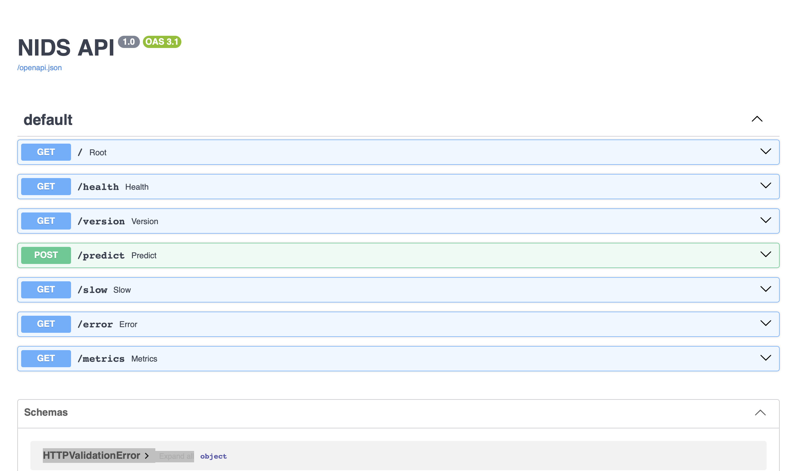
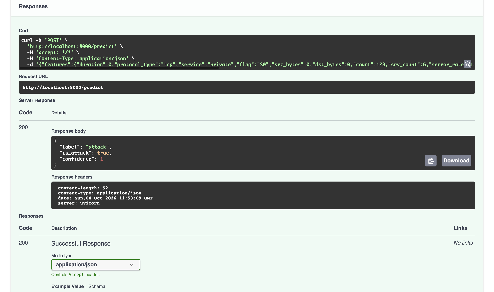
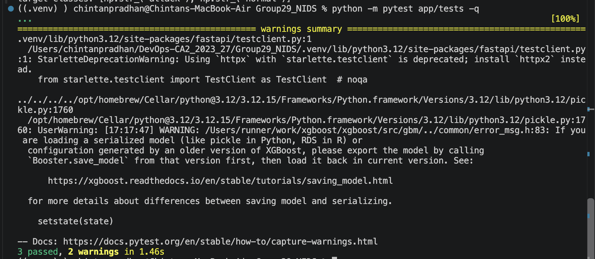

## Architecture
See [docs/architecture.md](docs/architecture.md).

## Step 1 - Deployment pipeline (GitHub Actions)
Workflow file: `pipeline/group29-ci.yml`. It runs pytest, builds the Docker image, pushes it to GHCR, then smoke tests it.
GitHub Actions only runs workflows from the repo root, so the pipeline was run on our fork (branch `ci-run`) with this same file at `.github/workflows/`. A copy is kept here so only this folder is submitted.
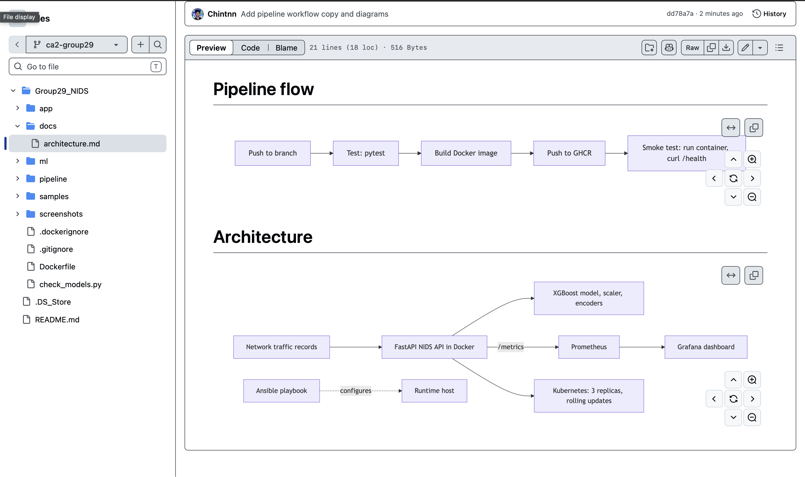
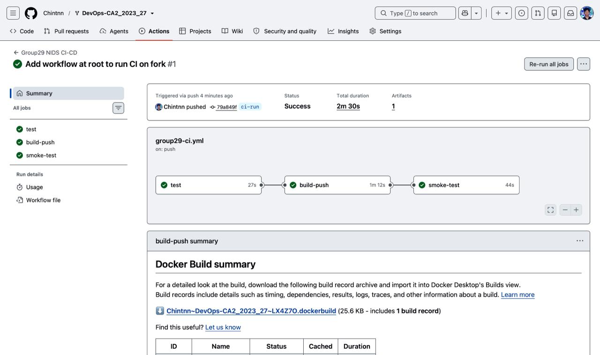
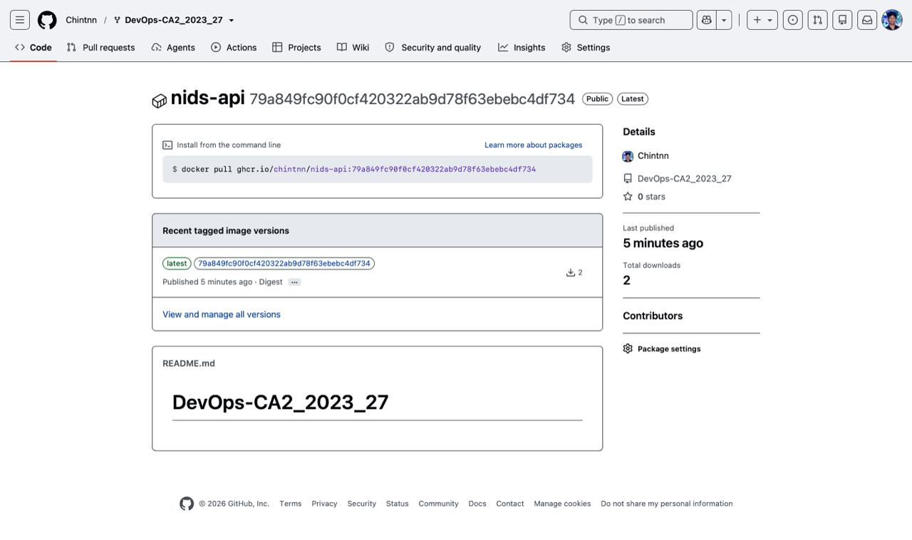

## Step 2 - Ansible
`ansible/playbook.yml` and `ansible/inventory.ini` install packages, create a user, manage files and set up a virtualenv. The second run changes nothing, which shows it is idempotent.
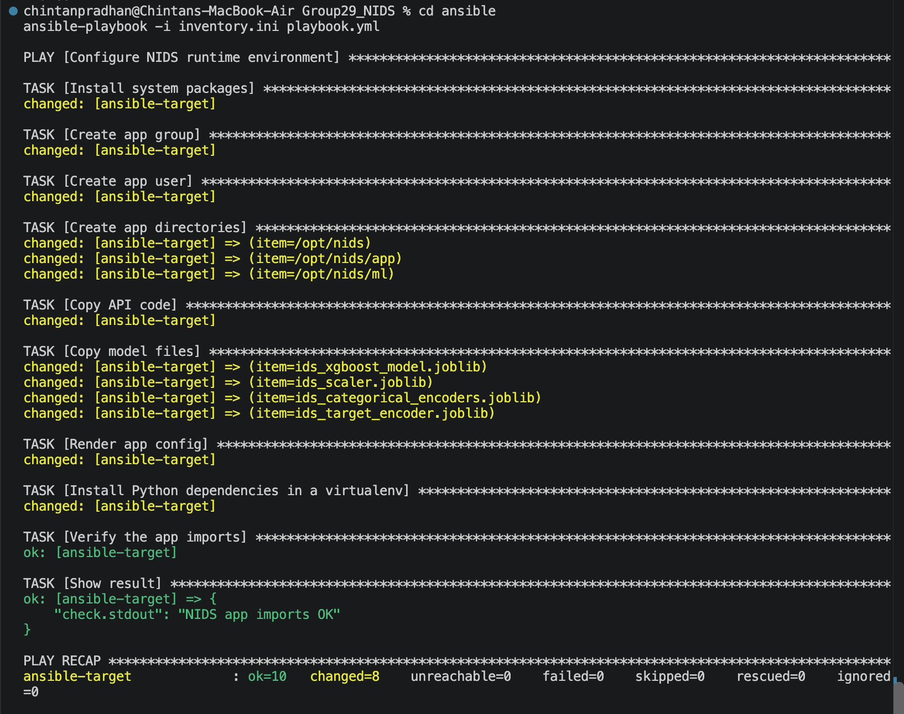
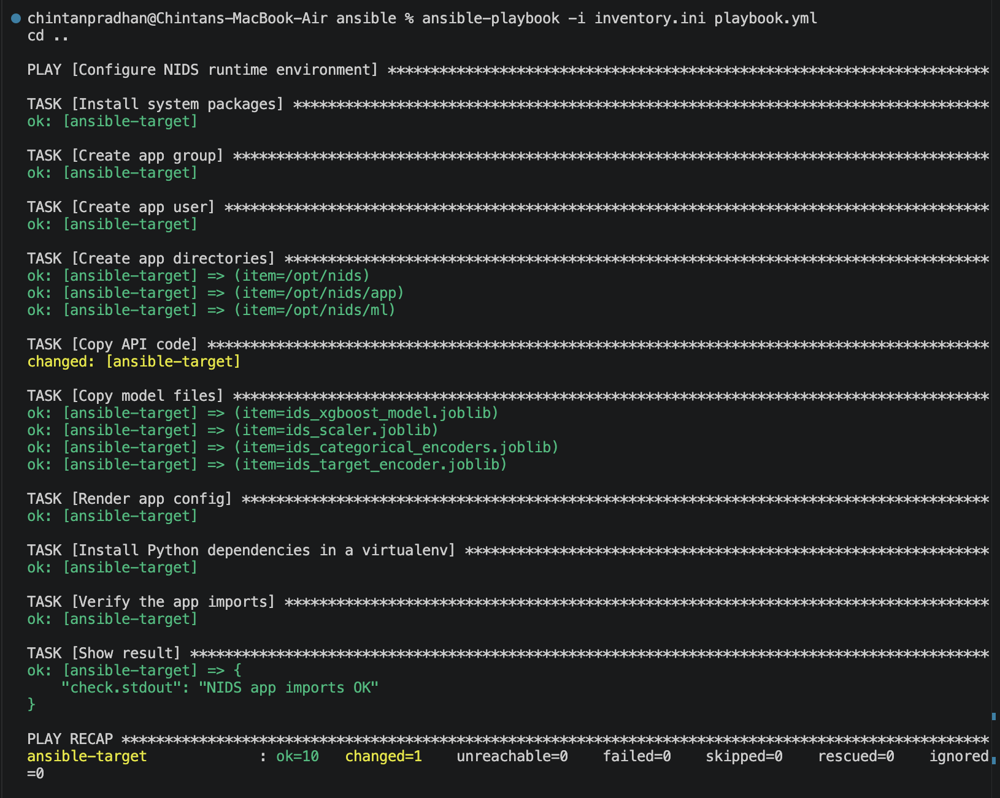

## Step 3 - Docker and Kubernetes
`Dockerfile`, `k8s/deployment.yaml`, `k8s/service.yaml`. Rolling update from v1 to v2, then rollback to v1.

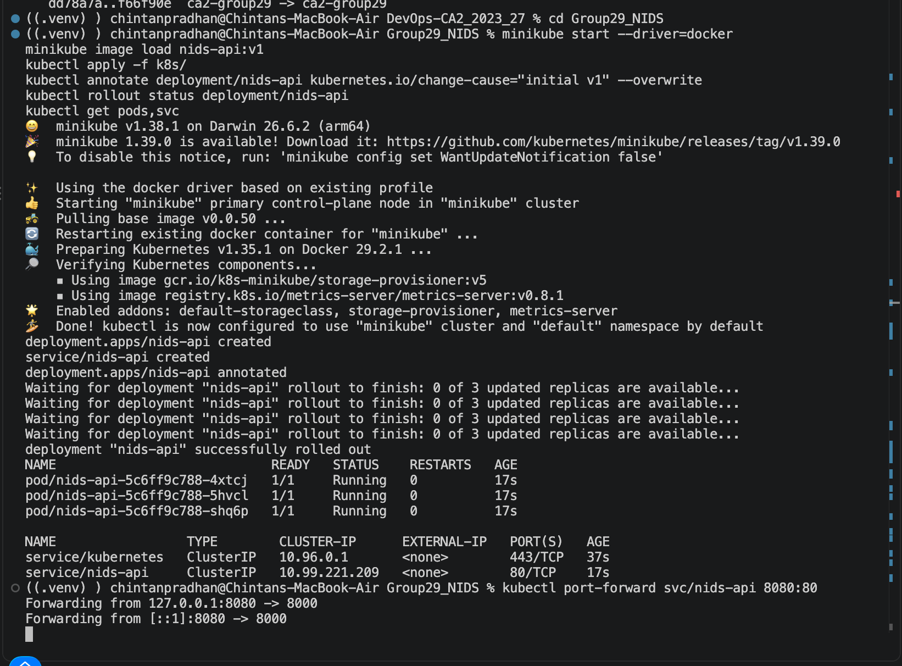

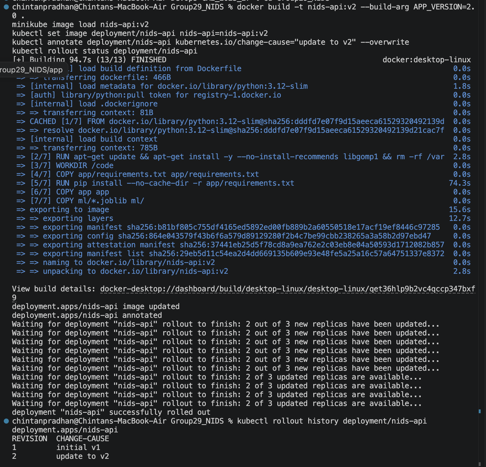

## Step 4 - Monitoring
Prometheus and Grafana in `monitoring/`. The dashboard covers uptime, latency p95, error rate and attacks detected.
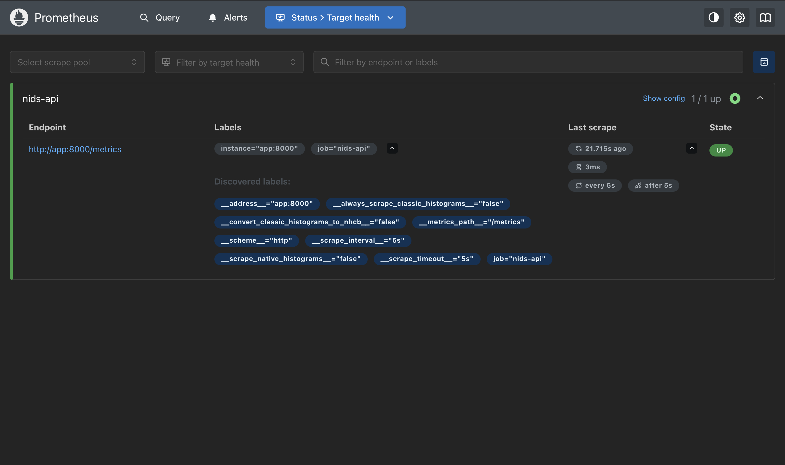
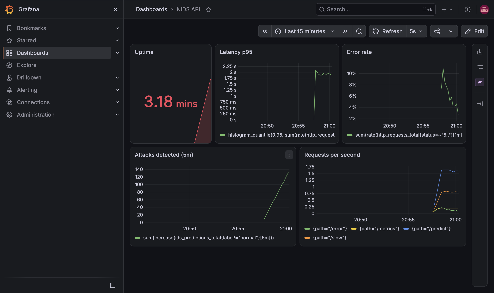

## How to run
`docker build -t nids-api:v1 .` then `docker run -p 8000:8000 nids-api:v1`, and open `/docs`.

