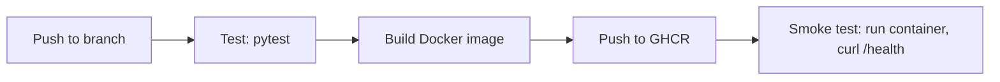
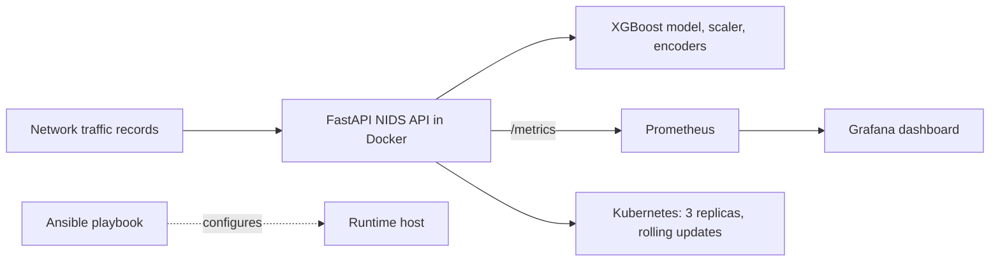

# Pipeline flow

```mermaid
flowchart LR
  A[Push to branch] --> B[Test: pytest]
  B --> C[Build Docker image]
  C --> D[Push to GHCR]
  D --> E[Smoke test: run container, curl /health]
```

# Architecture

```mermaid
flowchart LR
  T[Network traffic records] --> API[FastAPI NIDS API in Docker]
  API --> M[XGBoost model, scaler, encoders]
  API -->|/metrics| P[Prometheus]
  P --> G[Grafana dashboard]
  API --> K[Kubernetes: 3 replicas, rolling updates]
  ANS[Ansible playbook] -.configures.-> H[Runtime host]
```